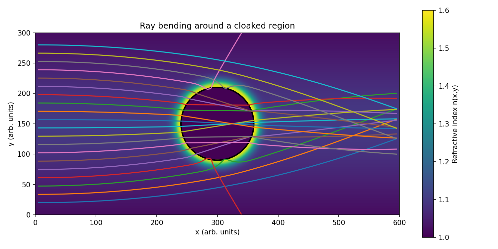

# Reconstruction-of-Cloaked-Objects-From-Phase-Only-Hologram

## 📄 Abstract
Title: Simulating Gradient-Index Cloaking and Phase-Only Holographic Camouflage for Computational Imaging
This project presents a dual-module simulation that explores two complementary paradigms in optical concealment and reconstruction: gradient-index (GRIN) ray cloaking and phase-only holographic camouflage. The first module models a spatially varying refractive index field that guides light rays around a circular cloaked region, demonstrating how engineered media can redirect optical paths in accordance with Fermat’s principle. A paraxial ray tracer numerically integrates ray trajectories through the GRIN field, visualizing the cloaking effect and its dependence on refractive gradients.
The second module simulates digital holography using angular spectrum propagation. A synthetic background interferes with a randomized phase object to generate a phase-only hologram. This hologram is then used to reconstruct the obscured scene, demonstrating how phase encoding can digitally restore visual information. The simulation includes both the hologram formation and the reconstruction process, offering insight into wavefront engineering and inverse imaging.
Together, these modules showcase the interplay between geometric and wave-based optics, and highlight the role of simulation in understanding and designing photonic systems. The project reflects strong proficiency in numerical modeling, scientific visualization, and algorithmic design—skills foundational to graduate-level research in computational imaging, holography, and photonic device engineering.

To save animations or run subprocesses, ensure FFmpeg is installed and accessible in your system path.

##  How to Run
run the script main.py

## 📚 Concepts Illustrated
• 	Gradient-index optics and Fermat’s principle
• 	Paraxial ray tracing in inhomogeneous media
• 	Angular spectrum propagation
• 	Phase-only holography and wavefront encoding
• 	Inverse imaging and digital reconstruction

## 🎓 Research Relevance
This project demonstrates core competencies in:
• 	Numerical modeling of optical systems
• 	Wavefront analysis and signal recovery
• 	Algorithmic design for inverse problems
• 	Scientific visualization and simulation

## 👤 Author
Developed by Alhassan Kpahambang Fuseini.

## 📄 License
This project is licensed under the MIT License. Feel free to use, modify, and share with attribution.
